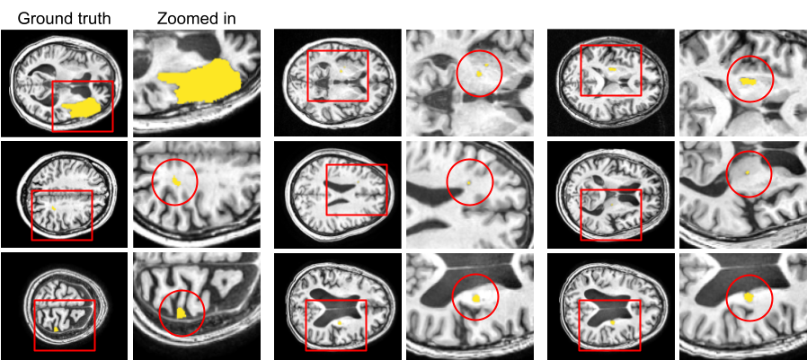
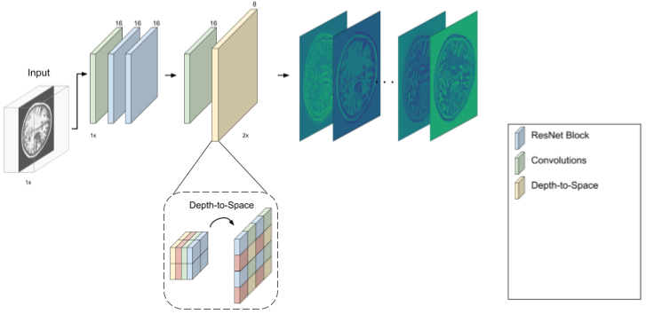
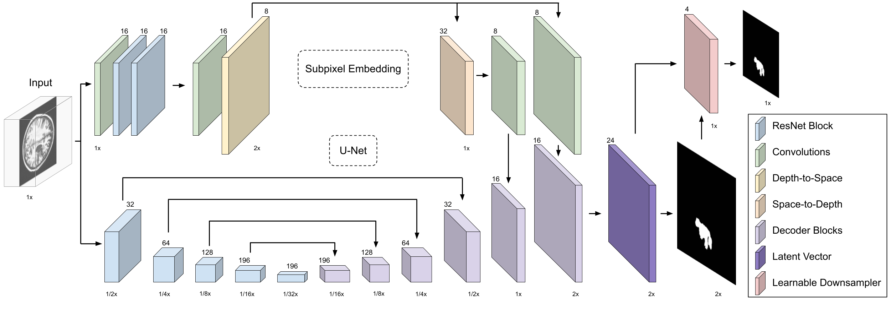
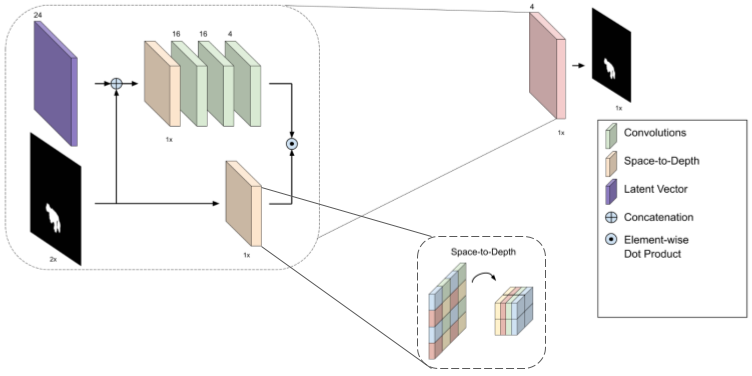
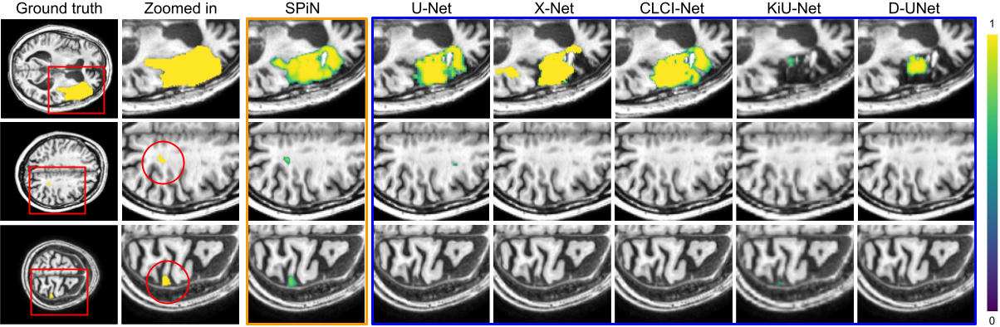

# Small Lesion Segmentation in Brain MRIs with Subpixel Embedding

PyTorch implementation of *Small Lesion Segmentation in Brain MRIs with Subpixel Embedding*

To appear in MICCAI Brain Lesion Workshop 2021 (ORAL)

[[publication]]() [[arxiv]](https://arxiv.org/pdf/2109.08791.pdf) [[poster]]() [[talk]]()

Model have been tested on Ubuntu 16.04, 20.04 using Python 3.6, 3.7, PyTorch 1.7.0, 1.7.1

Authors: [Alex Wong](http://web.cs.ucla.edu/~alexw/), [Allison Chen](https://allisonchen.us/), [Yangchao Wu](https://www.linkedin.com/in/yangchaowu/), [Safa Cicek](https://bsafacicek.github.io/), [Alexandre Tiard]()

If this work is useful to you, please cite our paper (to be updated from preprint to MICCAI):
```
@article{wong2021small,
  title={Small Lesion Segmentation in Brain MRIs with Subpixel Embedding},
  author={Wong, Alex and Chen, Allison and Wu, Yangchao and Cicek, Safa and Tiard, Alexandre and Hong, Byung-Woo and Soatto, Stefano},
  journal={arXiv preprint arXiv:2109.08791},
  year={2021}
}
```

**Table of Contents**
1. [About ischemic strokes](#about-ischemic-strokes)
2. [About stroke lesion segmentation](#about-stroke-lesion-segmentation)
3. [About Subpixel Network (SPiN)](#about-spin)
4. [Setting up](#setting-up)
5. [Downloading pretrained models](#downloading-pretrained-models)
6. [Running SPiN](#running-spin)
7. [Training SPiN](#training-spin)
8. [Running and training related works](#run-train-related-works)
9. [License and disclaimer](#license-disclaimer)

## About ischemic strokes <a name="about-ischemic-strokes"></a>

Ischemic strokes occur when a lack of blood flow prevents brain tissue from receiving adequate oxygen and nutrients and affect approximately 795,000 people annually. It’s currently the 5th leading cause of death in the United States and even upon recovery, many patients suffer from disability and even paralysis.

The severity of which is dependent on the size, location, and overlap of the lesions (caused by the stroke) with brain structures., but can be reduced with early diagnosis. Thus, preserving cognitive and motor function is dependent on identifying stroke lesions quickly and precisely, but doing so manually requires expert knowledge and is prohibitively time consuming. Here are some examples of manually traced lesions.

<p align="center">
    
</p>

## About stroke lesion segmentation <a name="about-stroke-lesion-segmentation"></a>

We focus on automatically identifying or segmenting ischemic stroke lesions from anatomical MRI images. Existing methods leverage deep convolutional neural networks that take as input an MRI image and output a heat or range map of confidence scores corresponding to lesion tissues. These lesions are often characterized by high variability in location, shape, and size. The latter two are problematic for conventional convolutional neural networks where the precision of irregularly shaped lesion boundaries and recall of small lesions are critical measures of success -- existing methods are able to capture the general shape of the large and medium sized lesions, but missed small ones and the intricacies in the boundary between lesion and normal tissue (see [figure](#atlas-results-teaser) below).

Because deep neural networks are comprise of fixed sized filters with limited receptive fields that filters operate locally, in order to obtain a global representation of the input, one must employ spatial downsampling by the means of max pooling or strided convolutions. This is often performed aggressively so that the design does not limit applicability. Hence, the bottleneck or latent vector is typically much smaller in spatial dimensions than the input, which means that the details of fine local structures are lost in the process.

## About Subpixel Network (SPiN) <a name="about-spin"></a>
To address this, we propose to learn an embedding that maps the input MRI image to high dimensional feature maps at double the input resolution where a single element or pixel in the image is represented by four subpixel feature vectors. Our subpixel embedding is comprised of a feature extraction phase using ResNet blocks and a spatial expansion phase that is achieved by rearranging elements from the channel dimension to the height and width dimensions using a depth to space operator.

Here we show the feature maps outputted by our subpixel embedding -- the high resolution feature maps contains anatomical structures that resembles the low resolution input MRI image.

<p align="center">
    
</p>

This is particularly interesting because there is no explicit constraints on the structure of the learned representation. We note that we only minimize cross entropy, but our subpixel embedding naturally learns to preserve the details of the input as high resolution feature maps.

Unlike the typical architecture, we do not perform any lossy downsampling on this representation;  hence, the embedding  can preserve fine details of local structures, but in exchange, it lacks global context. But when combined with the standard encoder-decoder architecture, our subpixel embedding complements the decoder by guiding it with fine-grained local information that is lost during the encoding process so that the network can resolve detailed structures in the output segmentation. We refer to this architecture as a subpixel network or **SPiN** for short.

<p align="center">
    
</p>

Unlike previous works, SPiN predicts an initial segmentation map at twice the input resolution where a single pixel in the input is predicted by a two by two neighborhood of subpixels in our output. The final segmentation at the original input resolution is obtained by combining the four subpixel predictions (akin to an ensemble) as a weighted sum where the contribution of each subpixel in a local neighborhood is predicted by a learnable downsampler.

Our learnable downsampler performs space-to-depth on the initial high resolution segmentation map and on each of channel of latent vector to rearrange each 2 by 2 neighborhood into a 4 element vector. This is followed by several convolutions and a softmax on the latent vector to learn the contribution or weight of each subpixel. The final segmentation at the input resolution is obtained by an element-wise dot product between the weights and the high resolution segmentation map.

<p align="center">
    
</p>

Unlike hand crafted downsampling methods such as bilinear or nearest-neighbor interpolation where the weights are predetermined and independent of the input, our learnable downsampler is directly conditioned on the latent vector of the input and its initial segmentation. Hence it is able to predict weights that better respect lesion boundaries to yield detailed segmentation. Here we show qualitative comparisons on the [ATLAS](atlas-paper) dataset.

<p align="center">
    
</p>
<a name="atlas-results-teaser"></a>

## Setting up your virtual environment <a name="setting-up"></a>
We assume CUDA 11.1, 11.0, 10.2, or 10.1 is installed

We will create a virtual environment with the necessary dependencies, please install the appropriate torch version based on your CUDA version.
```
virtualenv -p /usr/bin/python3.7 spin-py37env
source spin-py37env/bin/activate
pip install opencv-python scipy scikit-learn scikit-image matplotlib nibabel gdown numpy Pillow

# CUDA 11.0
pip install torch==1.7.1+cu110 torchvision==0.8.2+cu110 -f https://download.pytorch.org/whl/torch_stable.html

# CUDA 10.2
pip install torch==1.7.1 torchvision==0.8.2

# CUDA 10.1
pip install torch==1.7.1+cu101 torchvision==0.8.2+cu101 -f https://download.pytorch.org/whl/torch_stable.html

pip install tensorboard==2.3.0
```

## Setting up your datasets

### ATLAS
For datasets, we will use the Anatomical Tracings of Lesion After Stroke ([ATLAS][atlas-paper]) public dataset. You will need to sign an usage agreement in order to download the dataset. Please visit their [dataset page][atlas-dataset], follow the instructions (sign a form and email it to the maintainers) to obtain the data, and save them on your machine. The agreement should be title "ICPSR 3668 The Anatomical Tracings of Lesions after Stroke (ATLAS) Dataset - Release 1.2, 2018".

Once you have downloaded the ATLAS dataset (`ATLAS R 1.2.zip`), please unzip it to find
```
ATLAS R 1.2
|---- 20171106_ATLAS_Meta-Data_Release_1.1_Updated.xlsx
|---- native.zip
|---- standard_MNI.zip
|---- Supplementary_Information_Scanner_Header_Attributes.xlsx
```

Unzipping `standard_MNI.zip` will give `standard_part1.zip` and `standard_part2.zip` (post processed data), and doing so with `native.zip` will give `native_1.zip` and `native_2.zip`. Each patient data is compressed in those files. We will use the standard dataset. Please do the following to set up your dataset:
```
mkdir atlas
mkdir atlas/atlas_native
mkdir atlas/atlas_standard
mv ATLAS\ R\ 1.2 atlas/archive
unzip atlas/archive/standard_MNI.zip -d atlas/archive
unzip atlas/archive/native.zip -d atlas/archive
unzip atlas/archive/standard_part1.zip -d atlas/atlas_standard/
unzip atlas/archive/standard_part2.zip -d atlas/atlas_standard/
unzip atlas/archive/native_1.zip -d atlas/atlas_native/
unzip atlas/archive/native_2.zip -d atlas/atlas_native/
```

Our repository provides the training and testing (referred to as traintest) data split in the `data_split` folder. The setup script will create numpy (.npy) files from .nii files provided in the raw dataset. It will also create `training` and `validation` directories containing text (.txt) files with relative paths to all data samples.

Assuming you are in the root of your repository, follow these command to setup the data:
```
# Create a data folder
mkdir data
ln -s /path/to/atlas data/

# Activate the virtual environment
source spin-py37env/bin/activate

# Set up the dataset
python setup/setup_dataset_atlas.py
```

Additionally, please run the following for the small lesion subset discussed in our paper:
```
python setup/setup_dataset_atlas_small_lesion.py
```

### GLaS/WARWICK

Download the GLaS dataset from the [GLaS Website](glas-dataset). Assuming you have followed the steps above for the ATLAS dataset, navigate to your root directory and run the following:

```
ln -s /path/to/glas data/

source spin-py37env/bin/activate

python setup/setup_dataset_warwick.py
```

Your training and testing path .txt files will be in `training/warwick/traintest` and `testing/warwick/traintest` respectively. Because no explicit train/val split is provided, we train on the entire training set and validate and test on the test set.

### RITE

To obtain the RITE dataset, follow the instructions on [this page](rite-dataset).

Once you download `AV_groundTruth.zip`, unzip the file into a directory using `unzip AV_groundTruth.zip -d <your/directory>`. For example, `unzip AV_groundTruth.zip -d RITE_raw`. The `-d` flag will save the contents into the directory `RITE_raw`.

You will need to register in order to be granted access. Assuming you have followed the steps for the ATLAS datset, navigate to your root directory and run the following:

```
ln -s </path/to/RITE_raw>/AV_groundTruth data/

source spin-py37env/bin/activate

python setup/setup_dataset_rite.py
```

## Downloading our pretrained models <a name="downloading-pretrained-models"></a>
To use pretrained models trained on ATLAS, please use `gdown` to download the zip file from our Google Drive.
```
# Download with gdown
gdown https://drive.google.com/uc?id=1ZSeLeNT-LX1n4QR-r8fVzHk3KmufSps_

# Unzip to directory
unzip pretrained_models.zip
```

This will output a `pretrained_models` directory containing the checkpoint for our model. For the ease of future comparisons between different works, we also provide checkpoints for various methods compared in our paper. All models are trained on the proposed training and testing split on ATLAS. The directory will have the following structure:
```
pretrained_models
|---- spin
      |---- spin_atlas_traintest.pth
|---- u-net
      |---- unet_atlas_traintest.pth
.
.
.

|---- kiu-net
      |---- kiunet_atlas_traintest.pth
```

Note: `gdown` fails intermittently and complains about permission. If that happens, you may also download the models via:
```
https://drive.google.com/file/d/1ZSeLeNT-LX1n4QR-r8fVzHk3KmufSps_/view?usp=sharing
```

## Running SPiN <a name="running-spin"></a>

To run SPiN on the provided data splits (training, testing, small lesion subset), you may use our evaluation bash scripts located in the `bash/spin` directory.

To evaluate our pretrained model on our training and testing split:
```
bash bash/spin/evaluate/evaluate_spin_traintest.sh
```

The checkpoint should produce numbers consistent with Table 2 from our main paper:
| Model                 | DSC     | IOU     | Precision | Recall  |
| :-------------------- | :-----: | :-----: | :-------: | :-----: |
| U-Net                 | 0.584   | 0.432   | 0.674     | 0.558   |
| D-UNet                | 0.548   | 0.404   | 0.652     | 0.521   |
| CLCI-Net              | 0.599   | 0.469   | 0.741     | 0.536   |
| KiU-Net               | 0.524   | 0.387   | 0.703     | 0.459   |
| X-Net                 | 0.639   | 0.495   | 0.746     | 0.588   |
| SPiN (Ours)           | *0.703* | *0.556* | *0.806*   | *0.654* |


To evaluate our pretrained model on our small lesion subset:
```
bash bash/spin/evaluate/evaluate_spin_small_lesion.sh
```

The checkpoint should produce numbers consistent with Table 3 from our main paper:
| Model                 | DSC     | IOU     | Precision | Recall  |
| :-------------------- | :-----: | :-----: | :-------: | :-----: |
| U-Net                 | 0.368   | 0.225   | 0.440     | 0.316   |
| D-UNet                | 0.265   | 0.180   | 0.377     | 0.264   |
| CLCI-Net              | 0.246   | 0.178   | *0.662*   | 0.215   |
| KiU-Net               | 0.246   | 0.255   | 0.466     | 0.206   |
| X-Net                 | 0.306   | 0.213   | 0.546     | 0.268   |
| SPiN (Ours)           | *0.424* | *0.269* | 0.546     | *0.347* |

 Note: You may replace the `restore_path` argument in these bash scripts to evaluate your own checkpoints.

By default, our evaluation scripts activate the flag `--do_visualize_predictions`. In addition to logging the evaluation summary in the checkpoint path directory, this will create a subdirectory called `atlas_test_scans` with the ground truths and predictions for each 2D image for visualization purposes. For quicker evaluation, you may remove this argument from the bash scripts.

## Training SPiN <a name="training-spin"></a>
To train our method on ATLAS, you can directly run:
```
bash bash/spin/train/train_spin_traintest.sh
```

The bash script assumes that you are only using one GPU (`CUDA_VISIBLE_DEVICES=0`). To use multiple GPUs (if you want to train on a different dataset with larger images or using a larger batch size), you can modify the bash script with
```
export CUDA_VISIBLE_DEVICES=0,1
```
to use two GPUs.

Additionally, if you would like to train SPiN on your own dataset using our dataloader (`src/datasets.py`), you will need to convert your data into numpy (.npy) files and create files containing paths to each data sample as done in `setup/setup_dataset_atlas.py`.

Finally to monitor your training progress (training loss, visualizations, etc.), you can use `tensorboard`:

```
tensorboard --logdir trained_spin_models/<model_name>
```
Note: the frequency of logging tensorboard summaries and storing checkpoints are controlled by the `n_summary` and `n_checkpoint` arguments.

## Running and training related works <a name="run-train-related-works"></a>

To run the works we compare to on the provided data splits (training, testing, small lesion subset), you may use our evaluation bash scripts located in the `bash` directory. All of the checkpoints were the best (amongst several runs) produced by the methods below and should reproduce the numbers in the tables above (Table 2, 3 in main text).

### U-Net
Because we are using our in-house version of U-Net, there is no need create a new virtual environment.
You may use spin-py37env to run this method. If you want to keep it as a separate environment for cleaniness you can do:
```
virtualenv -p /usr/bin/python3.7 unet-py37env
source unet-py37env/bin/activate
pip install opencv-python scipy scikit-learn scikit-image matplotlib nibabel gdown numpy Pillow

# CUDA 11.0
pip install torch==1.7.1+cu110 torchvision==0.8.2+cu110 -f https://download.pytorch.org/whl/torch_stable.html

# CUDA 10.2
pip install torch==1.7.1 torchvision==0.8.2

# CUDA 10.1
pip install torch==1.7.1+cu101 torchvision==0.8.2+cu101 -f https://download.pytorch.org/whl/torch_stable.html

pip install tensorboard==2.3.0

```

To evaluate the U-Net model the testing set:
```
bash bash/u-net/evaluate/evaluate_unet_traintest.sh
```

To evaluate the U-Net model on our small lesion subset:
```
bash bash/u-net/evaluate/evaluate_unet_small_lesion.sh
```

To train U-Net model on ATLAS on the proposed training and testing split:
```
bash bash/u-net/train/train_unet_traintest.sh
```

### X-Net <a name="x-net"></a>
X-Net source code is in Tensorflow 1.10, so we will need to create a new virtual environment to avoid stepping on toes:
```
virtualenv -p /usr/bin/python3.6 xnet-py36env
source xnet-py36env/bin/activate
pip install opencv-python scipy scikit-learn scikit-image matplotlib nibabel gdown numpy Pillow
pip install gdown --no-use-pep517
pip install future==0.18.2 gast==0.5.0 tensorflow-gpu==1.10 h5py==2.7.0 keras==2.2.0
```

To evaluate the X-Net model with the testing set:

Make sure you have generated the `train.h5` and `data_order.txt` with:
```
source xnet-py36env/bin/activate
bash bash/generate_h5/gen.sh
```
first. The same h5 and txt files are used by KiU-Net and CLCI-Net as well.

To predict with the X-Net model:
```
source xnet-py36env/bin/activate
bash bash/X-Net/predict.sh
```
Meanwhile, we use our own evaluation function to evaluate the output results, which requires `spin-py37env` environment. (See [Setup](#setting-up))
To evaluate the predicted result:
```
source spin-py37env/bin/activate
bash bash/X-Net/eval.sh
```

### CLCI-Net
CLCI-Net source code is in Tensorflow 1.10, so we will need to create a new virtual environment. Dependencies are the same as X-Net so you may re-use  (See [X-Net](#x-net)), otherwise if you want to keep separate environments for cleaniness, you can follow these commands
```
virtualenv -p /usr/bin/python3.6 clcinet-py36env
source clcinet-py36env/bin/activate
pip install opencv-python scipy scikit-learn scikit-image matplotlib nibabel gdown numpy Pillow
pip install gdown --no-use-pep517
pip install future==0.18.2 gast==0.5.0 tensorflow-gpu==1.10 h5py==2.7.0 keras==2.2.0
```

To evaluate the CLCI-Net model with the testing set:

Make sure you have generated the `train.h5` and `data_order.txt` (See [X-Net](#x-net))

To predict with CLCI-Net model:
```
source xnet-py36env/bin/activate
bash bash/CLCI-Net/predict.sh
```

Meanwhile, we use our own evaluation function to evaluate the output results, which requires `spin-py37env` environment. (See [Setup](#setting-up))
To evaluate the predicted result:
```
source spin-py37env/bin/activate
bash bash/CLCI-Net/eval.sh
```

### DUnet
DUNet source code is in Tensorflow 1.10, so we will need to create a new virtual environment. Dependencies are the same as X-Net so you may re-use  (See [X-Net](#x-net)), otherwise if you want to keep separate environments for cleaniness, you can follow these commands
```
virtualenv -p /usr/bin/python3.6 dunet-py36env
source dunet-py36env/bin/activate
pip install opencv-python scipy scikit-learn scikit-image matplotlib nibabel gdown numpy Pillow
pip install gdown --no-use-pep517
pip install future==0.18.2 gast==0.5.0 tensorflow-gpu==1.10 h5py==2.7.0 keras==2.2.0
```

To evaluate the DUnet model with the testing set:

To predict and evaluate the DUnet model:
```
source xnet-py36env/bin/activate
bash bash/DUnet/predict.sh
```

### KiU-Net
KiU-Net is implemented in Torch, but still uses some dependencies from X-Net, DUnet and CLCI-Net. So we will create a new environment for it:
```
virtualenv -p /usr/bin/python3.7 kiunet-py37env
source kiunet-py37env/bin/activate
pip install opencv-python scipy scikit-learn scikit-image matplotlib nibabel gdown numpy Pillow

# CUDA 11.0
pip install torch==1.7.1+cu110 torchvision==0.8.2+cu110 -f https://download.pytorch.org/whl/torch_stable.html

# CUDA 10.2
pip install torch==1.7.1 torchvision==0.8.2

# CUDA 10.1
pip install torch==1.7.1+cu101 torchvision==0.8.2+cu101 -f https://download.pytorch.org/whl/torch_stable.html

pip install h5py==2.7.0 tensorboard==2.3.0
```

To evaluate the KiU-Net model with the testing set:

Make sure you have generated the `train.h5` and `data_order.txt` (See [X-Net](#x-net))

To process the testing data, run:
```
source xnet-py36env/bin/activate
bash bash/KiU-Net/process_data.sh
```

To predict and evaluate with KiU-Net model, run:
```
source kiunet-py37env/bin/activate
bash bash/KiU-Net/predict.sh
```


## License and disclaimer <a name="license-disclaimer"></a>
This software is property of the UC Regents, and is provided free of charge for research purposes only. It comes with no warranties, expressed or implied, according to these [terms and conditions](license). For commercial use, please contact [UCLA TDG](https://tdg.ucla.edu).

[atlas-paper]: https://www.nature.com/articles/sdata201811.pdf
[atlas-dataset]: https://www.icpsr.umich.edu/web/ADDEP/studies/36684/versions/V3
[glas-dataset]: https://warwick.ac.uk/fac/cross_fac/tia/data/glascontest/download/
[rite-dataset]: https://medicine.uiowa.edu/eye/rite-dataset